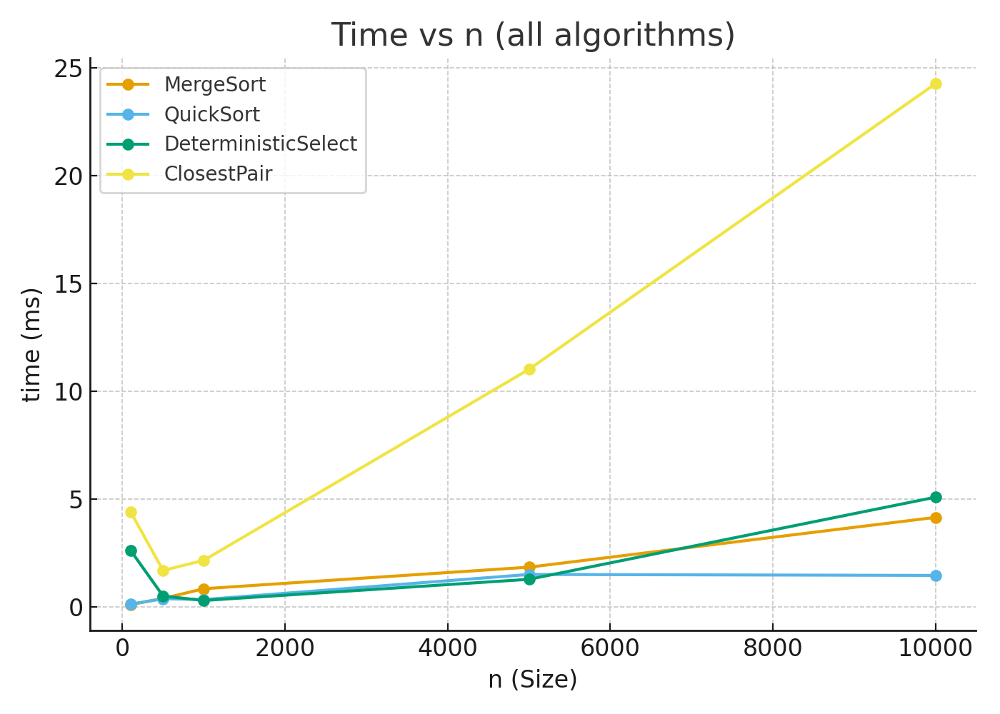
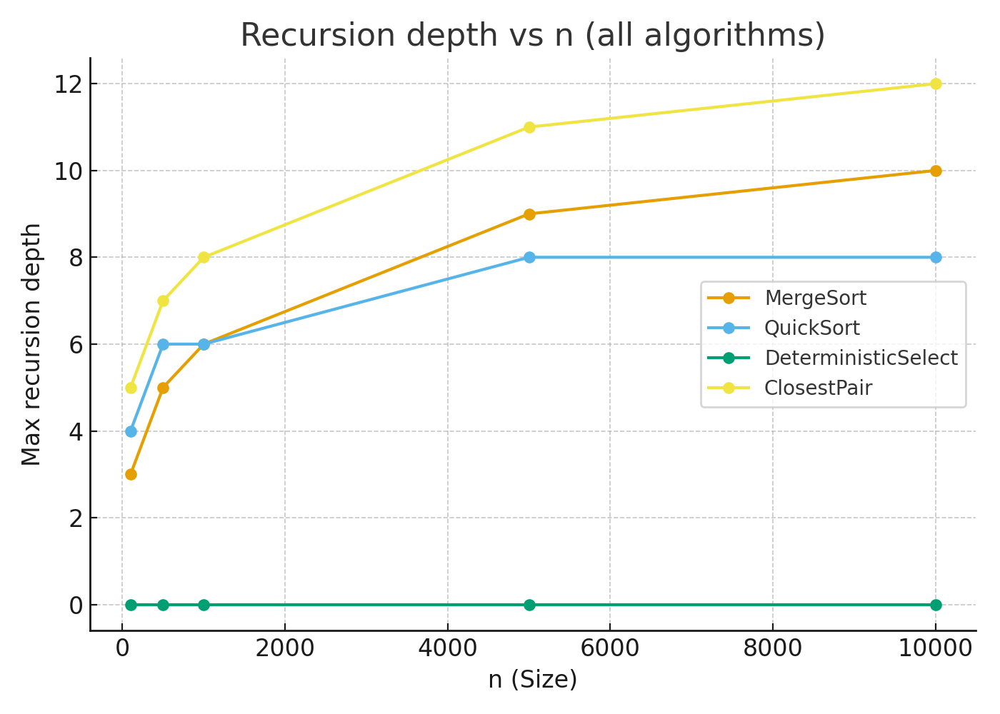
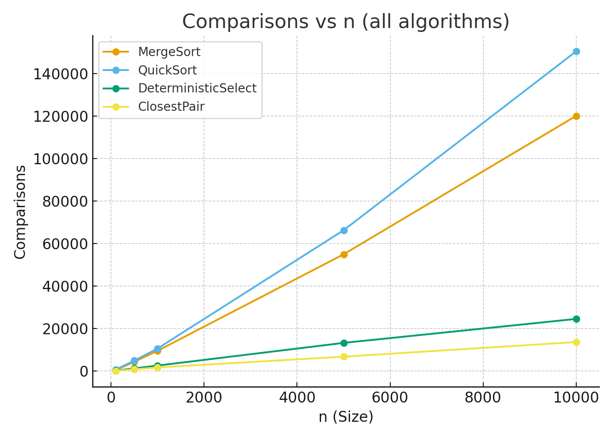

# Assignment 1: Divide-and-Conquer Algorithms

## Author
Aida Bekpayeva — GitHub: [abekpaye](https://github.com/abekpaye)

---

## 1. Project Overview

This project implements four classic divide-and-conquer algorithms in Java and provides measurements of their performance. The focus was on writing clean and safe recursive code, analyzing running times, and validating results with metrics.

Implemented algorithms:
- **MergeSort** (with buffer reuse and cutoff to insertion sort)
- **QuickSort** (randomized pivot, smaller-first recursion, bounded stack depth)
- **Deterministic Select** (Median-of-Medians, linear time worst-case)
- **Closest Pair of Points in 2D** (classic O(n log n) approach with strip scanning)

In addition, a small metrics system was built to track:
- Execution time
- Maximum recursion depth
- Number of comparisons and allocations

---

## 2. Architecture Notes

- Metrics are collected via lightweight counters and written to a CSV file.
- MergeSort uses a single reusable buffer to minimize allocations.
- QuickSort avoids deep recursion by always recursing on the smaller partition and iterating over the larger one.
- Deterministic Select recurses only into the side that contains the target index.
- Closest Pair implementation uses presorting by x and y to keep the merge step efficient.

---

## 3. Recurrence Analysis

**MergeSort**  
`T(n) = 2T(n/2) + Θ(n)` → Master Theorem (Case 2) → Θ(n log n).

**QuickSort (Randomized)**  
Expected `T(n) = T(n/2) + T(n/2) + Θ(n)` → Θ(n log n). Worst-case avoided by randomization.

**Deterministic Select (Median of Medians)**  
`T(n) = T(n/5) + T(7n/10) + Θ(n)` → by Akra–Bazzi intuition → Θ(n).

**Closest Pair of Points (2D)**  
`T(n) = 2T(n/2) + Θ(n)` → Master Theorem (Case 2) → Θ(n log n).

---

## 4. Experimental Results

### Execution Time vs n

### Recursion Depth vs n

### Comparisons vs n

**Discussion:**
- MergeSort and QuickSort both show Θ(n log n) growth, consistent with theory.
- Deterministic Select runs in linear time with shallow recursion.
- Closest Pair also scales as Θ(n log n).
- Constant factors (e.g. cache effects, JVM garbage collection) influence absolute timings but not asymptotic trends.

---

## 5. Testing

- Sorting algorithms were validated on both random and adversarial arrays.
- QuickSort recursion depth stayed below ~2·log₂(n), as expected with random pivots.
- Select results were checked against `Arrays.sort(a)[k]` in 100 random trials.
- Closest Pair was verified against a brute-force O(n²) implementation for small cases (n ≤ 2000).

---

## 6. Git Workflow

- **Branches**
    - `main` — stable releases only (tags v0.1, v1.0)
    - `feature/mergesort`, `feature/quicksort`, `feature/select`, `feature/closest`, `feature/metrics`

- **Commit storyline**
    - `init:` Maven setup, JUnit5, CI, README
    - `feat(metrics):` counters, depth tracker, CSV writer
    - `feat(mergesort):` baseline + buffer reuse + cutoff + tests
    - `feat(quicksort):` randomized pivot, smaller-first recursion + tests
    - `refactor(util):` partition, swap, shuffle helpers
    - `feat(select):` deterministic select (MoM5) + tests
    - `feat(closest):` closest pair implementation + tests
    - `feat(cli):` CLI to run algorithms and emit CSV
    - `docs(report):` recurrence analysis and plots
    - `fix:` edge cases (duplicates, very small inputs)
    - `release:` v1.0

---

## 7. Summary

All four algorithms were implemented and tested successfully.  
Theoretical results align well with experimental data.  
Metrics and plots confirm recursion depth and running time bounds.  
The project demonstrates both correctness and efficiency, while keeping the code simple and clean.
